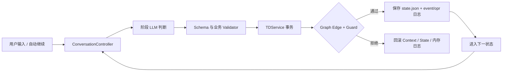

# 2026-08-11 TOE-DAC 设计审计与进度总结

## 结论

当前 TD 是按持久化状态机执行的。`ConversationController` 负责驱动循环和调用模型/Skill，`TDService` 负责业务校验与原子提交，`Graph + Machine` 决定事件是否可以沿某条边推进，`state.json` 保存断点，事件与操作日志保留审计轨迹。

本次审计前，主流程虽然已经状态机化，但关键约束主要位于 Service，Graph 没有实际业务 Guard；同时 `(source, target)` 唯一键会覆盖平行边。审计确认 `recovering → failed : give_up` 已被 `runtime_budget_exhausted` 覆盖。这不是文档问题，而是一条实际不可达的恢复路径。

修补后，状态机可以作为最后一道控制边界：Validator 先验证输入，Guard 再验证转换瞬间的 Context 不变量；只有两层都通过才提交持久化状态。

## 当前执行链



主链仍是：

```text
Target → Observe → Estimate → Decide → Act → Action Check → Target Check
```

其中 Check 分成两层：Action Check 证明动作符合断言，Target Check 证明整体结果真正满足用户目标。

## 状态机审计结果

### 已经合理的部分

- 六阶段责任清晰，Action Check 与 Target Check 分离；
- `waiting_human`、`paused`、`recovering` 都是显式状态，可跨 Session 恢复；
- 终态只读，新需求必须创建新 User Thread；
- 状态 Context、事件日志、操作日志、证据和 Artifact 已持久化；
- 恢复具有 TD 预算和 Action 尝试预算；
- 异常处理结果无论成功或失败都会进入经验账本。

### 本次发现并修复的问题

1. Graph 不能保存同一状态对的多条边，导致 `give_up` 被覆盖；现已改成有向多重图。
2. Machine 只检查第一条候选边；现会按声明顺序评估所有候选 Guard。
3. Graph 没有业务 Guard；现已覆盖六阶段主链、人工等待、恢复选择、终态和 Check 分支。
4. Guard 或 Hook 失败可能留下部分 Context/日志变化；现统一原子回滚。
5. `available_events` 过去只看静态边；现在会过滤 Guard 未通过的事件。
6. 本地源码可能导入外部 `andy_state` 同名包；引擎现已迁入 `toe_dac.state_machine`。
7. Estimate 明确不可行现在使用独立的 `estimate_not_feasible` 事件进入失败终态，而不是冒充“运行预算耗尽”。

## Guard 分层

| 层 | 责任 | 示例 |
| --- | --- | --- |
| Schema | 模型工具输出形状 | 必需字段、类型、枚举 |
| Validator | 业务对象内部一致性 | Target 非空、Plan 无环、Action ID 唯一 |
| Graph Guard | 状态转换瞬间的不变量 | Plan 已激活且有当前 Action、全部 Action 已通过才能进入 Target Check |
| Check | 对动作与目标的事实验收 | action assertion、target criterion |

Guard 必须是纯判断，不调用模型、不执行命令、不写文件。外部副作用只允许发生在受控 Act/Skill 执行器中。

## 今日完成的工程进度

- 明确 Target 只对齐用户意图和效果，证据留存不进入 Target；
- 每个阶段自动保存带阶段前缀的模型与工具原始证据；
- Web 操作保存截图与页面元数据，状态变化的 Act 保存 before/action/after；
- 引入渐进式 Skill 加载和受控异步 `run-cmd`，避免每轮暴露全部工具；
- Observe 仍保留模型判断，机械化仅用于路径、文件名、日志和证据注册；
- 增加模型调用、Skill 调用、自动修复、重试和耗时显示；
- 修复 DeepSeek `IncompleteRead`、连接中断和 SSL 超时的重复整阶段重跑；
- 完成异常经验的匹配、模型采纳/拒绝、Treatment 和成功/失败效果回写；
- 完成状态机多重边、Guard、原子回滚和包隔离审计修复。
- 181 项自动化测试通过，wheel 构建、本机覆盖安装与模型配置诊断通过。

## 尚未完成

- 父子 TD 和父任务验收契约尚未实现；
- 多 Action 目前按依赖串行执行，尚未并发调度；
- `state.json` 与两个 JSONL 日志是跨文件提交，进程级崩溃时仍需增加 journal/reconcile 机制；
- Guard 拒绝目前会写操作错误，但尚未单独形成统一的 `guard_evaluated` 结构化日志；
- 真实 SSH、Web、长命令等场景仍需持续积累基准数据。

## 下一步建议

1. 增加状态快照与 JSONL 的启动对账，自动修复最后一次未完整提交；
2. 将 Guard 的名称、输入摘要和拒绝原因写入 `opr.jsonl`；
3. 实现父子 TD：父 TD 只规划和验收，子 TD 执行并上报证据；
4. 用标准回归任务持续比较直接模型调用与 TOE-DAC 的耗时、Token、成功率和人工介入次数。
