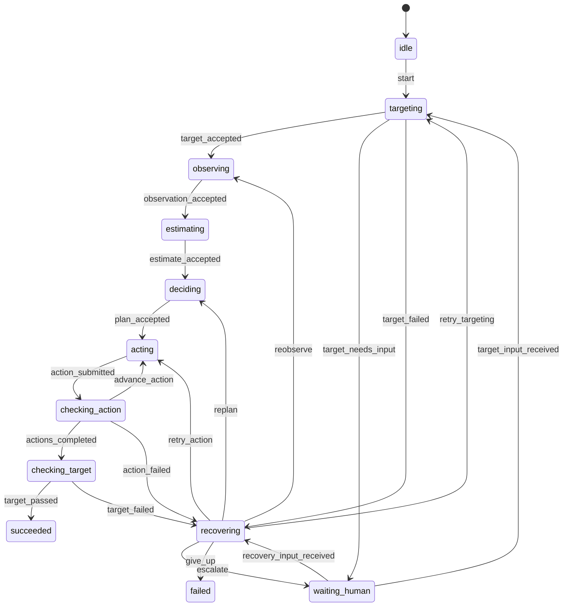

# TOE-DAC 交互式原型状态机设计

## 1. 设计目标

首个原型用于验证：一个 TD（TOE-DAC 实例）能否在多次交互式会话中，按照
Target → Observe → Estimate → Decide → Act → Check 推进，并在中断后从持久化状态恢复。

本阶段由人手工提交每一步的结构化结果，状态机负责：

- 限制合法的阶段转换；
- 校验每一步的最低完成条件；
- 保存当前状态和上下文；
- 记录可追溯的事件与操作；
- 在 Check 失败时进入受预算约束的恢复流程；
- 在需要人工处理时暂停，而不是把任务错误地标记为失败。

## 2. 原型边界

### 包含

- 单个 User Thread；
- 单个 TD 实例；
- 一个 TD 可跨多个 Session；
- 六阶段主流程；
- Decide 产生 Action 列表；
- 每个 Action 独立执行并进行 action check；
- 所有 Action 完成后执行 target check；
- 状态、事件、操作与证据索引持久化；
- 暂停、恢复、有限重试和人工介入。

### 暂不包含

- 父子 TD；
- LLM 自动生成六阶段结果；
- 真实 Shell、浏览器或 API 工具执行；
- 并发 Action；
- 向量经验检索；
- Web API 和图形界面。

## 3. 核心对象

```text
UserThread 1 ── N TD 1 ── N Session
                     └── 1 Plan 1 ── N Action 1 ── N Attempt
```

原型只运行一个 TD，但数据结构保留上述标识，避免后续迁移。

## 4. 状态定义

状态使用稳定、可序列化的小写字符串。

| 状态 | 类型 | 说明 |
|---|---|---|
| `idle` | 辅助 | TD 已创建，等待开始 |
| `targeting` | 核心 | 定义成功、失败边界及评估方法 |
| `observing` | 核心 | 收集与目标相关的环境事实 |
| `estimating` | 核心 | 评估可行性、风险、成本与信息缺口 |
| `deciding` | 核心 | 生成可执行 Action 图或顺序列表 |
| `acting` | 核心 | 执行当前原子 Action |
| `checking_action` | 核心 | 检查当前 Action 的断言 |
| `checking_target` | 核心 | 检查整体结果是否满足 Target |
| `recovering` | 辅助 | 根据失败信息决定重试、重规划或回退观察 |
| `waiting_human` | 辅助 | 等待人工补充信息、授权或作出选择；通过 `return_to` 恢复 |
| `paused` | 辅助 | 主动暂停，保留恢复点 |
| `succeeded` | 终态 | target check 通过 |
| `failed` | 终态 | 不可恢复或恢复预算耗尽 |
| `cancelled` | 终态 | 用户主动取消 |

说明：TOE-DAC 的 Check 被拆成 `checking_action` 和 `checking_target`，避免“命令执行成功”被误判为“目标已经实现”。

## 5. 主流程



用户只提交 Action Check 结果。控制层验证断言后，根据 Action 游标发送 `advance_action` 或 `actions_completed`。两个事件分别表达“当前动作通过并继续”与“全部动作完成”，日志无需反查 Guard 即可理解转移语义。底层 Graph 已支持同一状态对之间的多条平行边，以及同一事件下按 Guard 选择目标状态。

## 6. 事件定义

### 6.1 主链事件

| 事件 | 源状态 | 目标状态 | 含义 |
|---|---|---|---|
| `start` | `idle` | `targeting` | 启动 TD |
| `target_accepted` | `targeting` | `observing` | Target 结构通过校验 |
| `target_needs_input` | `targeting` | `waiting_human` | 存在歧义或缺少定义目标所需的信息 |
| `observation_accepted` | `observing` | `estimating` | Observation 结构通过校验 |
| `estimate_accepted` | `estimating` | `deciding` | Estimate 结构通过校验且允许规划 |
| `plan_accepted` | `deciding` | `acting` | Plan 结构通过校验并选中首个 Action |
| `action_submitted` | `acting` | `checking_action` | 当前 Action 产生执行结果及证据 |
| `advance_action` | `checking_action` | `acting` | 当前 Action 通过且仍有后续 Action |
| `actions_completed` | `checking_action` | `checking_target` | 当前 Action 通过且全部 Action 已完成 |
| `target_passed` | `checking_target` | `succeeded` | Target 验收通过 |

### 6.2 恢复事件

| 事件 | 源状态 | 目标状态 | 含义 |
|---|---|---|---|
| `target_failed` | `targeting` | `recovering` | Targeting 过程发生超时、模型或内部执行异常 |
| `action_failed` | `checking_action` | `recovering` | 当前 Action 验证失败 |
| `target_failed` | `checking_target` | `recovering` | 全部 Action 完成但 Target 未达成 |
| `retry_targeting` | `recovering` | `targeting` | 创建新的 Targeting Attempt，重试目标定义过程 |
| `retry_action` | `recovering` | `acting` | 创建新 Attempt，重试当前 Action |
| `replan` | `recovering` | `deciding` | 当前方案失效，生成新 Plan 版本 |
| `reobserve` | `recovering` | `observing` | 环境事实不足或已经变化 |
| `escalate` | `recovering` | `waiting_human` | 需要人类输入或授权 |
| `target_input_received` | `waiting_human` | `targeting` | 保存 Target 问题的人工答复并创建新 Target revision |
| `recovery_input_received` | `waiting_human` | `recovering` | 保存异常处置所需的人工答复并继续恢复决策 |
| `give_up` | `recovering` | `failed` | 不可恢复或预算耗尽 |

### 6.3 控制事件

| 事件 | 合法源状态 | 目标状态 | 含义 |
|---|---|---|---|
| `pause_from_<state>` | 任意非终态、非 `idle` | `paused` | 保存 `paused_from`；对每个源状态声明唯一事件 |
| `resume_to_<state>` | `paused` | 指定原状态 | 根据 `paused_from` 选择唯一恢复事件 |
| `request_human` | 除 `targeting` 外的业务阶段 | `waiting_human` | 保存当前状态到 `return_to`，主动请求人工输入；实现时按来源状态使用唯一事件名 |
| `cancel` | 任意非终态 | `cancelled` | 用户取消 TD |

终态在原型中不可 reset。若需重新执行，应创建新 TD，避免覆盖历史。

## 7. Guard 定义

| Guard | 最低检查条件 |
|---|---|
| `has_valid_target` | 正向目标、反向边界、验收条件均非空 |
| `target_needs_human_input` | 存在无法安全推断的歧义或关键信息缺口 |
| `has_valid_observation` | 至少有一条事实；每条事实带来源或标记为人工输入 |
| `estimate_allows_decide` | 结论为 `feasible`；风险、成本和信息缺口字段存在 |
| `has_valid_plan` | 至少一个 Action；ID 唯一；依赖可解析；不存在环；每个 Action 有断言 |
| `has_current_action_result` | 当前 Attempt 有结构化执行结果 |
| `action_assertions_passed` | 当前 Action 的全部必要断言通过 |
| `more_actions` | 仍有依赖已满足但未完成的 Action |
| `all_actions_done` | 所有 Action 均为 `passed` |
| `target_assertions_passed` | Target 的全部必要验收条件通过 |
| `retry_budget_available` | 当前 Action 与 TD 总预算均未耗尽 |
| `has_recovery_decision` | 恢复类型、原因和依据均存在 |
| `has_paused_state` | `paused_from` 是合法的可恢复状态 |
| `has_human_return_state` | 答复事件与 `return_to`、等待原因相匹配 |

Guard 只判断是否允许转移，不执行外部副作用。

### 7.1 当前实现

- Graph 是有向多重图，边的身份由 `source + event + target` 表达，不再以状态对作为唯一键；
- Machine 对同一 `source + event` 的候选边逐条评估 Guard，选择第一条通过的边；
- Guard 异常按 fail-closed 处理，不允许状态转移；
- `available_events` 只返回当前 Context 下 Guard 已通过的事件；
- `send()` 对 Context、State 和内存转移日志实行原子回滚；
- TD 主链、人工等待、恢复决策、Check 结果和终态失败均配置了结构化 Guard；
- 引擎位于 `toe_dac.state_machine` 命名空间，避免与开发机上的 `andy_state/state_machine` 发生包名冲突。

## 8. Context 设计

```json
{
  "schema_version": "0.1",
  "user_thread_id": "ut_xxxxxx",
  "td_id": "td_xxxxxx",
  "parent_td_id": null,
  "session_id": "ss_xxxxxx",
  "state": "targeting",
  "revision": 1,
  "created_at": "ISO-8601",
  "updated_at": "ISO-8601",
  "target": {
    "positive": [],
    "negative": [],
    "acceptance_criteria": []
  },
  "observation": {
    "facts": [],
    "unknowns": []
  },
  "estimate": {
    "verdict": null,
    "risks": [],
    "cost": {},
    "information_gaps": []
  },
  "plan": {
    "plan_id": null,
    "version": 0,
    "actions": []
  },
  "execution": {
    "current_action_id": null,
    "attempts": [],
    "completed_action_ids": []
  },
  "checks": {
    "action_checks": [],
    "target_check": null
  },
  "recovery": {
    "retry_count": 0,
    "retry_budget": 3,
    "last_failure": null,
    "decision": null
  },
  "control": {
    "paused_from": null,
    "waiting_reason": null,
    "return_to": null,
    "human_question": null,
    "human_response": null
  },
  "artifacts": []
}
```

`state` 必须显式持久化；不能只保存业务 Context 后用默认初态重建机器。

## 9. Action 最小结构

```json
{
  "action_id": "a_001",
  "objective": "完成一个可独立验证的动作",
  "depends_on": [],
  "instruction": "由执行者使用的操作说明",
  "assertions": [
    {
      "assertion_id": "as_001",
      "description": "动作完成的判断条件",
      "required": true
    }
  ],
  "max_attempts": 2,
  "status": "pending"
}
```

原型先按依赖顺序串行执行。Action 数据已经允许表达 DAG，但暂不并发调度。

## 10. 持久化结构

以下原型结构已经由 Storage V2 取代，现行规范以
[CLI 准 Web 服务与持久化设计](runtime-storage-design.md) 为准。特别是，Session 的
`trace/sessions/<session_id>/screenshots/` 就是截图的正式证据位置，不存在需要再次复制的 `./evidence/`。

```text
data/
├── threads/
│   └── <user_thread_id>/
│       ├── thread.json
│       ├── messages.jsonl
│       ├── sessions/
│       │   └── <session_id>.json
│       └── td/
│           └── <td_id>/
│               ├── state.json
│               ├── event.jsonl
│               ├── operation.jsonl
│               ├── trace/sessions/<session_id>/screenshots/
│               └── artifacts/
└── experience/
    ├── ledger.jsonl
    └── index.json
```

- `state.json`：当前机器状态与 Context 快照，使用临时文件 + 原子替换写入；
- `event.jsonl`：面向用户的状态转移和里程碑；
- `operation.jsonl`：结构化记录输入、Guard 结果、状态转移和错误细节；
- `experience/ledger.jsonl`：跨 TD 追加记录异常出现、处置、采纳决策和成功/失败结果；
- `experience/index.json`：从经验账本投影出的检索字段和策略统计，可丢弃后重建；
- Thread 下的 `sessions/`：记录该需求的每次交互式运行、结束状态和关联 TD；
- `trace/sessions/<session_id>/screenshots/`：保存截图原始证据；该目录本身即正式证据位置；
- `artifacts/`：保存 TD 的阶段性或最终产物。

日志采用追加写入。`state.json` 是运行快照，`operation.jsonl` 是恢复和审计的事实记录。

## 11. 单次交互协议

CLI 每轮只完成一次明确操作：

1. 载入 TD；
2. 展示当前状态、待提交字段和合法事件；
3. 接收用户选择及 JSON 输入；
4. 校验输入；
5. 尝试状态转换；
6. 写入操作日志和事件日志；
7. 原子保存状态；
8. 返回新状态和下一步提示。

校验失败时保持原状态，并记录被拒绝的操作；不把校验失败自动视为业务失败。

## 12. Targeting 失败语义

Targeting 只负责把目标定义得清晰且可验证，不负责判断目标在当前环境中是否可行。可行性判断属于 Estimate。

Targeting 的非成功结果分为三类：

| 类型 | 事件与路径 | 恢复预算 | 处理方式 |
|---|---|---|---|
| 输入校验失败 | 操作结果 `target_rejected`，不发生状态转换 | 不消耗 | 返回字段错误，等待提交者修正 |
| 目标歧义或信息不足 | `target_needs_input`：`targeting → waiting_human` | 不消耗 | 保存问题及 `return_to=targeting`，获得答复后返回 Targeting |
| 执行异常或超时 | `target_failed`：`targeting → recovering` | 消耗 | 通过 `retry_targeting` 重试、请求人工处理或耗尽预算后失败 |

`target_rejected` 是交互操作结果，不是状态机事件。它必须产生一条被拒绝的 operation 记录，但不产生状态转移事件。重复提交相同无效输入时，可由交互层提示用户，但状态机仍保持在 `targeting`。

人工答复返回 Targeting 后，应创建新的 Target revision，不覆盖之前的草稿和问题记录。

## 13. 异常模型

异常至少包含：

```json
{
  "phase": "act",
  "cause": "assertion_failed",
  "recoverable": true,
  "message": "健康检查未通过",
  "action_id": "a_001",
  "attempt_id": "at_002",
  "evidence_refs": [],
  "occurred_at": "ISO-8601"
}
```

原型支持的 `cause`：

- `invalid_input`
- `missing_information`
- `permission_required`
- `execution_error`
- `assertion_failed`
- `environment_changed`
- `timeout`
- `budget_exceeded`
- `cancelled_by_user`

## 14. 异常经验模型

异常经验不是只保存成功方案，而是保存完整链路：

```text
异常出现
  → 匹配相似场景
  → Agent 决定采纳或拒绝已有经验
  → 执行处置策略
  → Check 判断成功或失败
  → 追加结果并更新策略统计
```

成功和失败都属于经验：

- 成功经验用于提高相似场景下对应策略的候选优先级；
- 失败经验用于降低已证明无效路径的优先级，减少无谓探索；
- 失败经验不能被简单删除，否则 Agent 会重复尝试相同路径；
- 失败经验通常用于降权，不应在环境存在差异时直接成为永久禁令。

### 14.1 经验事件

`experience/ledger.jsonl` 采用追加写入，不原地修改历史。每条事件带 `scope_id`、`user_thread_id` 和 `td_id`；检索只能访问当前授权作用域。最小事件类型为：

| 事件 | 产生时机 |
|---|---|
| `exception_observed` | 异常被结构化识别时 |
| `experience_matched` | 检索到一个或多个相似经验时 |
| `experience_rejected` | Agent 判断某条匹配经验不适用时 |
| `experience_adopted` | Agent 决定采用某条经验时 |
| `treatment_started` | 处置策略开始执行时 |
| `treatment_succeeded` | Check 证明处置有效时 |
| `treatment_failed` | Check 证明处置无效时 |

`experience_adopted` 只表示决策；`use_count` 在 `treatment_started` 后增加，避免把“选择但未执行”统计为使用。

### 14.2 经验记录

```json
{
  "experience_id": "exp_xxxxxx",
  "exception": {
    "phase": "act",
    "cause": "assertion_failed",
    "message": "健康检查未通过",
    "target_summary": "部署容器服务",
    "environment": ["docker", "linux"],
    "action_summary": "启动应用容器"
  },
  "treatment": {
    "strategy": "调整健康检查启动等待时间后重试",
    "source": "matched_experience",
    "matched_experience_ids": ["exp_previous"],
    "adoption": {
      "decision": "adopted",
      "reason": "环境和失败断言一致",
      "confidence": 0.82
    }
  },
  "outcome": {
    "status": "success",
    "action_check_passed": true,
    "target_check_passed": null,
    "side_effects": []
  },
  "applicability": {
    "conditions": ["容器处于启动阶段"],
    "exclusions": ["容器已退出且退出码非零"]
  },
  "source_refs": {
    "user_thread_id": "ut_xxxxxx",
    "td_id": "td_xxxxxx",
    "session_id": "ss_xxxxxx",
    "event_ids": [],
    "evidence_refs": []
  }
}
```

一次异常可以有多个 Treatment Attempt。每次尝试分别记录成功或失败，最终 TD 成功不能覆盖此前失败的处置记录。

### 14.3 匹配与采纳

匹配输入至少包含：

- `phase` 与 `cause`；
- Target 摘要；
- 当前 Action 摘要；
- 环境标签与关键观察事实；
- 错误特征、断言和证据摘要。

检索层只提供候选及相似度，不直接决定执行。Agent 必须对候选作出结构化决定：

```json
{
  "decision": "adopted",
  "experience_id": "exp_xxxxxx",
  "reason": "失败阶段、环境和断言一致",
  "confidence": 0.82
}
```

Agent 也可以选择 `rejected`，并记录不适用原因。拒绝不会增加使用次数，但可以作为未来改进匹配质量的数据。

### 14.4 策略统计投影

`experience/index.json` 保存跨 TD、可重建的统计投影：

```json
{
  "experience_id": "exp_xxxxxx",
  "match_count": 4,
  "adopt_count": 3,
  "use_count": 3,
  "success_count": 2,
  "failure_count": 1,
  "last_matched_at": "ISO-8601",
  "last_used_at": "ISO-8601",
  "effectiveness": 0.6667
}
```

更新规则：

1. 被检索为候选时增加 `match_count`；
2. Agent 决定采纳时增加 `adopt_count`；
3. 处置真正开始时增加 `use_count`；
4. Check 通过时增加 `success_count`；
5. Check 失败时增加 `failure_count`；
6. 所有计数更新必须通过唯一事件 ID 保证幂等；
7. 排序应同时参考相似度、适用条件、成功/失败统计和样本量；
8. 统计投影损坏时可以从 `experience/ledger.jsonl` 重建；
9. 匹配必须先按授权作用域过滤，再计算相似度，不能跨越数据边界。

## 15. 待确认的设计决策

1. **Estimate 不可行时的路径**：建议进入 `waiting_human`，由人决定修改 Target、补充信息或终止，而不是直接失败。
2. **恢复策略由谁决定**：交互式原型建议先由人从 `retry_action / replan / reobserve / escalate / give_up` 中选择，后续再接 Agent 自动决策。
3. **Target 修改方式**：建议任何 Target 实质修改都创建新 revision，并使旧 Plan 失效，保留完整历史。
4. **终态是否允许重开**：当前建议不允许；继续工作应创建新 TD 或后续引入派生 TD。

## 16. 原型验收标准

- 能创建 TD，并完整走通六阶段；
- Action Check 与 Target Check 明确分离；
- 非法事件或无效输入不会破坏当前状态；
- Targeting 的校验失败、信息不足和执行异常走不同恢复路径；
- 关闭进程后能从准确状态恢复；
- Check 失败后能按预算重试或回退；
- 暂停及人工等待可以跨 Session 恢复；
- 每次转换都能通过日志追溯到输入、Guard 结果和证据；
- 每次异常的出现、处置及成功/失败结果都能形成经验事件；
- 复用经验时能够记录匹配、采纳、实际使用和最终效果；
- 成功必须由 Target Check 触发，不能由 Action 执行结果直接触发。
